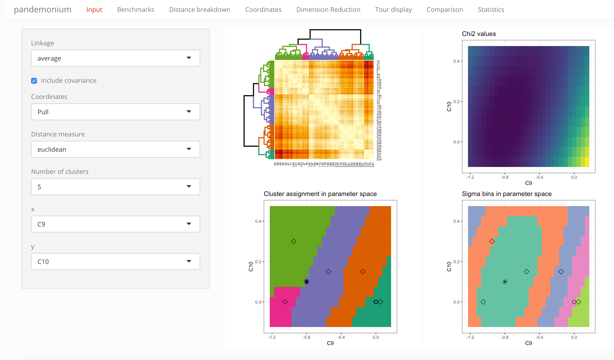
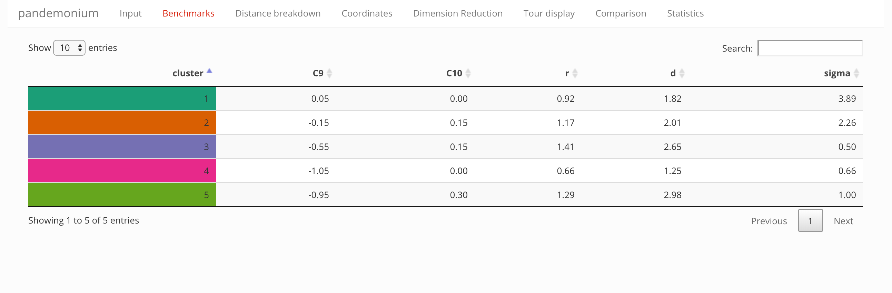
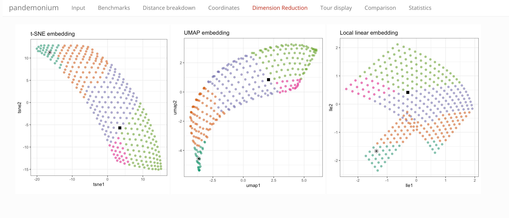
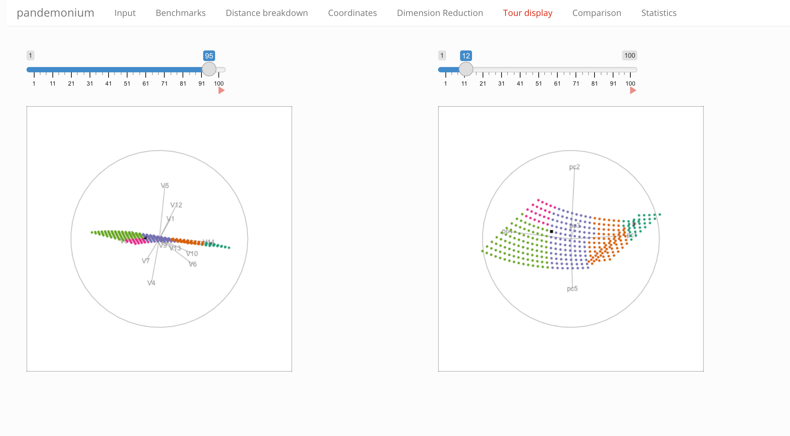

```{r, include = FALSE}
knitr::opts_chunk$set(
  collapse = TRUE,
  comment = "#>"
)
```

To start the app load the package and call the pandemonium function.
Here we are using the example data included with the package. Check the
description of the input requirements in the input vignette.

```{r setup, eval=FALSE}
library(pandemonium)
pandemonium(b_anomaly$pred, b_anomaly$covInv, b_anomaly$wc, b_anomaly$exp)
```

The app has seven separate tabs described below.

# Tab Input

```{r echo=FALSE, out.width='100%'}

```

Select the settings for clustering from the drop-down lists:

- Linkage
- Coordinates (with tick-box to include correlations in the definition)
- Distance measure
- Number of clusters

Below these settings you can also select the parameters used for the parameter
space visualization: which parameter should be on the x- and y-axis, and what
condition should be used for parameters not shown.

Next to these selections the tab contains four visualizations:

- Heatmap with dendrogram 
- Across the selected parameter slice:
  - $\chi^2$ values
  - cluster assignment
  - bins in $\chi^2$ (equidistant in $\sigma$)

# Tab Benchmarks

```{r echo=FALSE, out.width='100%'}

```

This tab contains a table summarizing information about the clusters
and benchmark points:

- parameter values of the representative benchmarks
- cluster radius and diameter
- distance from the best fit (in units of $\sigma$)

# Tab Distance breakdown

```{r echo=FALSE, out.width='100%'}
knitr::include_graphics('./distances.png')
```

This tab contains two plots that summarize the distance information:

- a histogram showing distances of points within vs between clusters, for each
cluster (the gray histogram shows the overall distribution of distances for
reference)
- box plots showing the coordinate-wise differences within and between clusters

# Tab Coordinates

```{r echo=FALSE, out.width='100%'}
knitr::include_graphics('./coordinates.png')
```

This tab contains plots that show the coordinates in different displays:

- the variation of coordinate values across the selected parameter slice
- a parallel coordinate plot showing the centered coordinate values
- a similar parallel coordinate plot showing centered and scaled coordinate
values (i.e. removing scale differences)

# Tab Dimension Reduction

```{r echo=FALSE, out.width='100%'}

```

Showing all points in 2D representations of the observable space, color
is showing the cluster assignment. Three methods of dimension reduction are
compared:

- t-SNE
- UMAP
- Local linear embeddings

# Tab Tour display

```{r echo=FALSE, out.width='100%'}

```

A tour display showing the cluster assignment of all points in the full
observable space (left) or the first five principal components (right).

# Tab Comparison

```{r echo=FALSE, out.width='100%'}
knitr::include_graphics('./comparison.png')
```

Select two clustering settings for direct comparison in the selected
parameter space slice and via the heatmap display.

# Tab Statistics

```{r echo=FALSE, out.width='100%'}
knitr::include_graphics('./stats.png')
```

A range of cluster statistics evaluated between two and eight clusters:

- WB ratio
- Normalized gamma
- Dunn index
- Calinski and Harabasz index
- Minimum radius
- Maximum radius
- Maximum diameter
- Minimum benchmark distance
- ARI with CI binning


